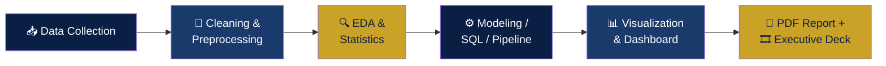

<!-- ═══════════════ HEADER ═══════════════ -->

---

## 🧭 What This Repo Is

> **13 complete data-analytics projects** built during my Data Analyst program at **HEXA Solutions** — spanning **EDA, SQL, statistics, machine learning, API pipelines, and BI dashboards** across 8 industry domains. Every project ships with a **PDF report + executive presentation + reproducible code**, following a consistent CRISP-DM workflow.

**Integrity standard applied throughout:** only dual-route verified figures are printed as results; all analysis is reproducible from the code in this repo; a live-demonstration offer stands for every project.

### 🔑 Headline Verified Results

| 🎯 Finding | 📊 Figure | 📁 Project |
|---|---|---|
| Dubai price-per-sqft model output | **99 AED/sqft** | Dubai House Price Model |
| Flipkart CSAT decline gradient | **4.48 → 3.66** | Flipkart CSAT Analysis |
| Sedentary-time vs sleep correlation | **r = −0.60** | Strava/Fitbit Fitness Data |

---

## 📊 The 13 Projects

🚚 <b>Logistics & Mobility (3)</b> — <i>click to expand</i>

 

| # | Project | What I Did | Stack |
|---|---|---|---|
| 01 | **FedEx Logistics EDA** | Shipment-level exploratory analysis — delivery patterns, delay drivers, route-level insights | Python · Pandas · Matplotlib |
| 02 | **Uber Supply–Demand Gap** | Quantified request-vs-fulfilment gaps by hour and pickup point; identified peak-failure windows | Python · EDA · Viz |
| 03 | **India EV Market Dashboard** | Interactive dashboard of EV adoption, maker share, and state-level penetration | Power BI |

🛒 <b>E-Commerce & Retail (3)</b> — <i>click to expand</i>

 

| # | Project | What I Did | Stack |
|---|---|---|---|
| 04 | **Flipkart CSAT Analysis** | Statistical deep-dive on customer satisfaction — verified CSAT gradient **4.48 → 3.66**; built self-contained interactive Chart.js dashboard | Python · Stats · Chart.js |
| 05 | **Amazon Prime Content EDA** | Catalog composition, genre trends, and content-strategy signals | Python · Pandas |
| 06 | **Video Game Sales Analysis** | Regional sales patterns, platform lifecycles, publisher performance | Python · EDA |

💹 <b>Finance & Real Estate (2)</b> — <i>click to expand</i>

 

| # | Project | What I Did | Stack |
|---|---|---|---|
| 07 | **NSE Stock Market Analysis (SQL)** | Pure-SQL analysis on NSE data — windowed returns, sector screens, volume anomalies | SQL · SQLite |
| 08 | **Dubai House Price Model** | Regression model on Dubai property data — verified output **99 AED/sqft**; feature engineering + evaluation | Python · Scikit-Learn |

🍽️ <b>Food-Tech & Travel (2)</b> — <i>click to expand</i>

 

| # | Project | What I Did | Stack |
|---|---|---|---|
| 09 | **Zomato Restaurant EDA** | Cuisine, pricing, and rating landscape analysis across cities | Python · Pandas |
| 10 | **Airbnb Pricing Dashboard** | Listing-price drivers and neighbourhood comparisons in an interactive dashboard | Tableau |

🧠 <b>Health, Sports & People Analytics (3)</b> — <i>click to expand</i>

 

| # | Project | What I Did | Stack |
|---|---|---|---|
| 11 | **Strava/Fitbit Fitness Data** | Activity-vs-sleep behavioural analysis — verified correlation **r = −0.60** (sedentary time vs sleep) | Python · Stats |
| 12 | **Tennis Analytics — SportRadar API** | Live API ingestion pipeline → SQLite → **Streamlit app** for competition/player exploration | Python · API · Streamlit |
| 13 | **Mental Health in Tech Survey** | Workplace mental-health survey analysis — treatment-seeking drivers and employer-support gaps | Python · Stats |

---

## 🔁 The Repeatable Method (All 13 Projects)

Every project follows **CRISP-DM**: business understanding → data understanding → preparation → modeling/analysis → evaluation → reporting. Business questions are defined *before* touching the data.

---

## 📦 What Each Project Folder Contains

| Deliverable | Format | Description |
|---|---|---|
| 📄 **Project Report** | PDF | First-person analysis narrative — questions, method, findings, recommendations |
| 🎞️ **Executive Deck** | PPTX | Leadership-ready presentation of results |
| 🐍 **Code** | .py / .sql | Runnable scripts (11 across the repo) + SQLite databases |
| 📋 **Method Sheet** | PDF | One-page: dataset, 12-step method, results, skills demonstrated |

---

## 🛡️ Integrity & Reproducibility Standard

- ✅ **Verified Figures Register** — only dual-route traceable numbers are printed as results
- ✅ **Declared substitutions** — any synthetic/demo data is explicitly labelled, never passed as real
- ✅ **AI partnership disclosed** — AI used for structuring; analysis, decisions & validation are mine
- ✅ **Live-demo offer** — every project can be re-run end-to-end on request

---

## 👤 Author

**Eswar Mahalingam** · MBA · CSCMP SCPro · Six Sigma Black Belt
Data Analyst @ HEXA Solutions · Ghaziabad, India

